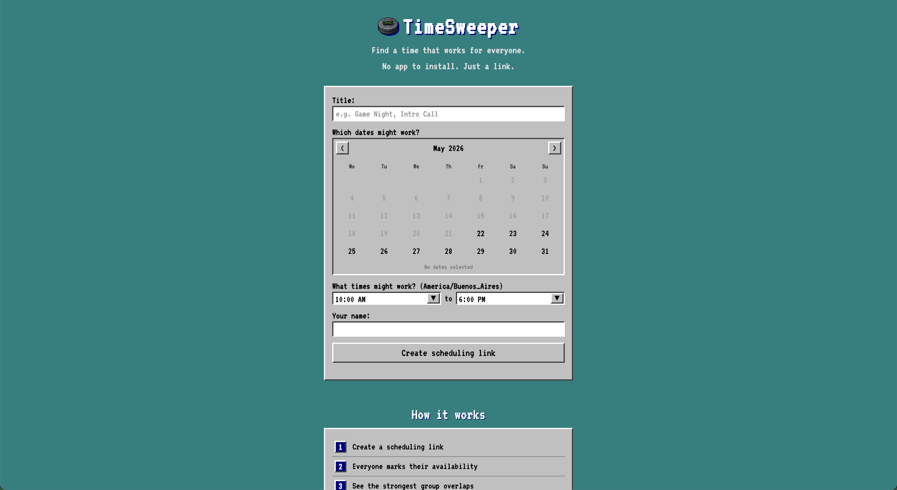
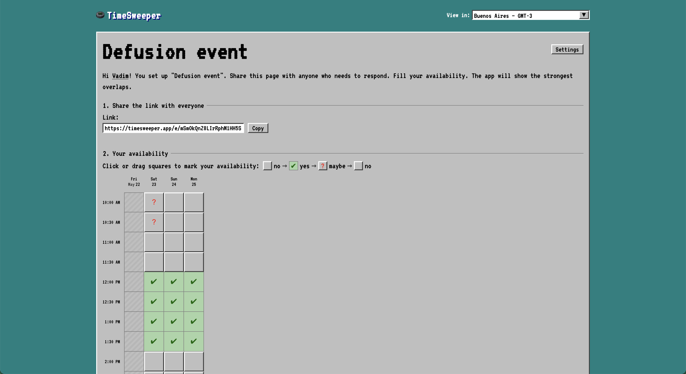

# TimeSweeper

A Windows 95 Minesweeper-themed group scheduling app. No accounts. One shareable link. Real-time availability grid.

---

 

---

## Features

- **No login required** — anyone with the link can set their availability
- **One shared link** — `/e/:eventId`, same URL for everyone
- **Availability grid** — click or drag to mark your own slots (Yes / Maybe / No)
- **Overlap table** — ranked list of times that work, showing who can and can't attend each
- **Real-time sync** — changes appear live for everyone on the same link
- **Offline-first** — your data lives in local storage first, syncs when online

---

## Tech

- **Frontend:** SolidJS + Vite, deployed to Cloudflare Pages
- **Local persistence:** TinyBase mergeable store in `localStorage` (CRDT)
- **Realtime sync:** WebSocket via TinyBase synchronizers
- **Backend:** Cloudflare Worker + Durable Objects
- **PWA:** manifest + service worker for offline support

---

## Develop

```bash
npm install
```

Start the Worker in one terminal:

```bash
npm run dev:api
```

Start the frontend:

```bash
npm run dev
```

Open `http://localhost:5173`. The frontend talks to `http://127.0.0.1:8787` for both HTTP and WebSocket.

---

## Deploy

```bash
npm run deploy:api   # Cloudflare Worker (Durable Objects)
npm run deploy:fe    # Cloudflare Pages (frontend)
npm run deploy       # both
```
